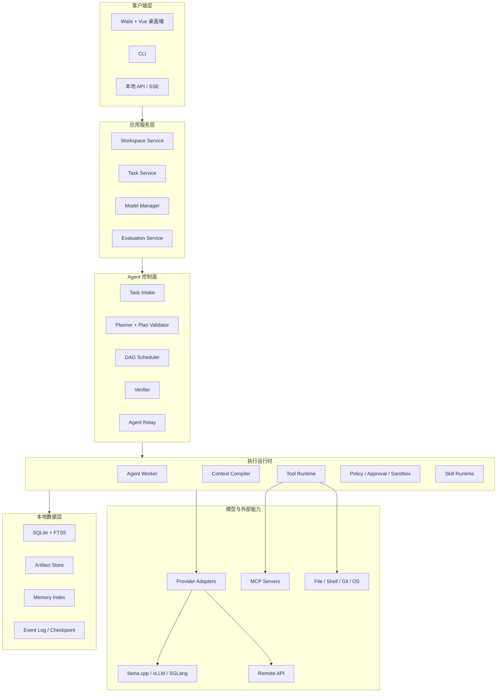
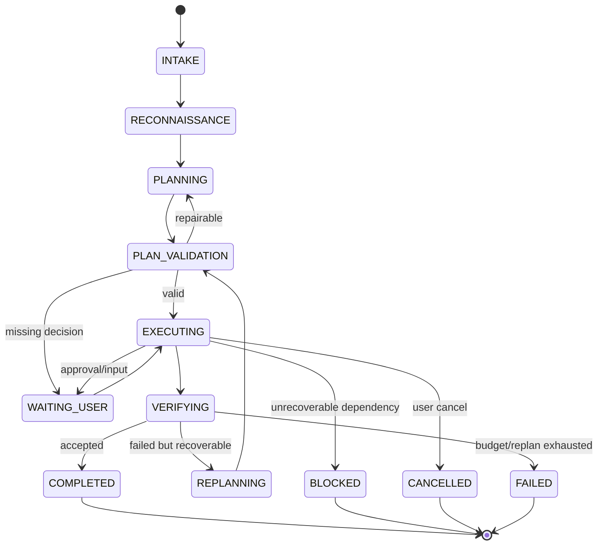
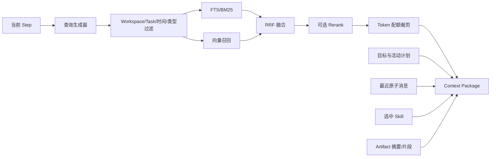

# SimplenessAgent 总体架构设计

## 1. 架构目标

架构需要同时满足：

- 本地桌面开箱使用。
- 本地模型和 API 模型统一接入。
- 小模型在有限上下文中稳定工作。
- 复杂任务先规划、后执行、再验证。
- 任务状态可持久化、重放和恢复。
- 工具调用安全、可取消、可审计、可幂等。
- 多 Agent 能隔离上下文并进行结构化接力。
- UI、CLI 和未来服务端复用同一 Agent Core。

## 2. 总体分层



## 3. 核心架构原则

### 3.1 控制面与模型分离

Task 状态由 Go 状态机管理。模型不能直接把 Step 从 `RUNNING` 改为 `COMPLETED`，只能返回候选结果和完成声明，由验证器和调度器决定状态迁移。

### 3.2 会话与任务分离

Session 用于交互展示，Task 用于执行事实。删除或压缩聊天消息不能破坏任务计划和恢复能力。

### 3.3 原始事件与派生视图分离

- Event Log、原始 ToolResult、Artifact 是事实来源。
- 当前 Task 状态、搜索索引、摘要和 Memory 是派生视图。
- 派生数据损坏后应可从原始事实重建。

### 3.4 模型与部署分离

模型名称不代表实际运行能力。`Model Profile` 描述模型行为，`Deployment` 描述具体端点、引擎、量化和能力探测结果。

### 3.5 大数据外置

长日志、大文件、完整补丁和工具输出进入 Artifact Store。上下文仅携带摘要、引用和必要片段。

## 4. 技术栈基线

| 层 | 选择 | 目的 |
|---|---|---|
| 核心语言 | Go 稳定版本，版本由 `go.mod` 锁定 | 单二进制、并发、取消、子进程和跨平台 |
| 桌面端 | Wails 稳定大版本 | 使用 Go 后端和系统 WebView，便于桌面打包 |
| 前端 | Vue 3 + TypeScript + Pinia | 构建可维护的任务工作台 |
| 本地数据库 | SQLite + WAL | 零运维、事务、恢复、单机分发 |
| 全文检索 | SQLite FTS5 | 本地关键词和中文 n-gram 检索 |
| Artifact | 文件系统内容寻址存储 | 保存大结果、去重和校验 |
| 模型协议 | OpenAI-compatible 优先，Provider 可扩展 | 统一本地和远程模型 |
| 本地 Runtime | llama.cpp 默认；vLLM/SGLang 高级接入 | 覆盖普通桌面和高性能部署 |
| 工具扩展 | 内置 Tool Registry + MCP Client | 稳定核心工具并兼容生态 |
| 事件流 | 内部 Event Bus + UI SSE/Wails Events | 解耦执行与界面 |
| 观测 | 结构化日志、Trace、Metrics | 调试、评测和回归 |

具体依赖版本在实现阶段通过 ADR 和锁文件确定，避免架构文档依赖短期版本号。

## 5. Agent 任务生命周期



所有状态迁移写入事件日志，并在事务中更新物化状态。

## 6. 一次复杂任务的主流程

### 6.1 Intake

将用户输入整理为 `TaskSpec`：

- 目标。
- 非目标。
- 工作区。
- 约束。
- 验收标准。
- 权限策略。
- 时间、步骤、Token 和成本预算。

缺少会实质改变结果的信息时进入 `WAITING_USER`；可以安全推断的内容形成显式假设。

### 6.2 Reconnaissance

通过只读工具收集最小必要事实：目录、文件、配置、测试方式、Git 状态、已有决策和相关 Skill。输出 `ReconReport` Artifact。

### 6.3 Planning

Planner 根据 TaskSpec 和 ReconReport 产生 `PlanVersion` 与 `StepSpec[]`。Planner 不获得写工具。

### 6.4 Plan Validation

程序检查：

- Step ID 唯一。
- 依赖存在且无环。
- Ready Step 可计算。
- 输出被正确引用。
- 每个步骤有完成条件。
- 风险与权限一致。
- 计划规模没有超过预算。

### 6.5 Execution

Scheduler 选择 Ready Steps，为每个步骤生成上下文并启动 Agent Worker。模型一次只处理一个子目标；独立步骤由 Scheduler 并发执行。

### 6.6 Verification

优先执行确定性验证：测试命令、文件存在、内容断言、退出码、Schema、Diff。无法确定性验证时才调用只读 Verifier Agent。

### 6.7 Replanning

只替换失败步骤及受影响的下游步骤，保留已验证完成部分。重规划次数受 TaskBudget 限制。

### 6.8 Completion

生成 FinalReport：目标完成情况、变更、证据、Artifact、风险、未完成项和运行指标。

## 7. 上下文数据流



Context Package 必须携带来源引用，便于模型和验证器定位事实。

## 8. 多 Agent 架构

Coordinator 是确定性调度器，不是自由对话模型。第一阶段角色包括：

- Planner：只读规划。
- Executor：执行单个步骤。
- Verifier：只读验证。
- Specialist Worker：由特定 Skill 驱动的执行者。
- Memory Curator：异步提炼候选记忆。

第一阶段限制：

- 子 Agent 深度最多一层。
- 默认并发 2，可配置但受本地推理吞吐限制。
- 子 Agent 不获得完整主会话。
- 子 Agent 只能通过 AgentReport 和 Artifact 返回结果。
- 子 Agent 不能直接把 Task 标记为完成。

## 9. 模型接入架构

```text
Agent Core
    -> ModelService
        -> Provider Adapter
            -> Deployment
                -> Local Managed Runtime
                -> Existing Local Endpoint
                -> Remote API
```

Provider 负责协议转换，Deployment 负责连接信息和实际能力，Model Profile 负责 Planner/Executor/Verifier 参数。

评测模式固定 Deployment，禁止静默故障转移；普通运行可以根据用户策略显式启用备用 Deployment。

## 10. 数据与持久化

### 10.1 SQLite 主要表域

- workspace、session、message。
- task、run、plan_version、step、step_dependency、attempt。
- event、checkpoint。
- tool_call、approval、permission。
- artifact、artifact_link。
- memory、memory_source、memory_relation。
- provider、deployment、model_profile、capability_probe。
- skill、skill_version、skill_resource。
- agent_instance、handoff、agent_report。
- evaluation_suite、evaluation_case、evaluation_run、metric。

### 10.2 Artifact Store

Artifact 采用内容哈希或稳定 ID 寻址。数据库保存元数据，文件系统保存正文。写入使用临时文件、校验和、原子替换，防止崩溃产生半成品。

### 10.3 Checkpoint

Checkpoint 保存结构化快照：

- TaskSpec。
- 当前 PlanVersion。
- Step 状态与 Ready Set。
- 关键决策和约束。
- Artifact 引用。
- 未完成审批。
- 预算消耗。
- 下一动作。

Checkpoint 不保存需要继续执行的内存闭包或 UI 状态。

## 11. 进程模型

### 11.1 主程序

负责 UI 生命周期、Agent Core、SQLite、任务调度和本地服务接口。

### 11.2 模型子进程

Model Manager 可启动受控的 llama.cpp Server：

- 随机或受控本地端口。
- 仅监听 loopback。
- 保存 PID、启动参数和日志 Artifact。
- 健康检查与就绪探测。
- 退出时优雅终止，异常时可重启。

vLLM/SGLang 初期作为外部端点接入，避免主安装包引入 Python、CUDA 和 WSL 复杂依赖。

### 11.3 工具子进程

命令工具使用独立进程组，支持超时、取消、输出限制和退出码。后台服务必须返回句柄，后续通过状态/输出/终止工具管理。

## 12. 安全边界

- Workspace 之外的文件访问默认拒绝。
- 路径在执行前规范化并解析符号链接。
- 命令风险由策略引擎判断，模型声明仅作参考。
- 密钥写入操作系统凭据存储，不进入日志和模型上下文。
- Tool Call 在执行前写入意图和幂等键。
- 沙箱不可用时不得静默退回无限制本地执行。
- MCP 工具按 Server、Tool 和参数范围授权。

## 13. 可扩展边界

以下扩展通过稳定接口完成：

- Provider Adapter。
- Tool Provider 和 MCP Server。
- Skill 包。
- VectorIndex 和 Reranker。
- Verification Rule。
- Sandbox Backend。
- UI 客户端。

核心 Task、Plan、Event、Artifact 和权限模型不应被插件直接替换。

## 14. 架构验证方式

架构不是通过图验收，而是通过以下场景验收：

1. 使用 Mock Provider 完成完整 Task 生命周期。
2. 在任意 Step 工具执行前后强制退出并恢复。
3. 本地和 API Deployment 运行同一 Golden Task。
4. 故意制造无效工具参数，确认不会执行。
5. 故意制造超大工具输出，确认 Artifact 外置和上下文预算有效。
6. 故意制造失败测试，确认只重规划必要下游步骤。
7. 子 Agent 仅凭 Handoff 恢复并完成单步骤。
8. 删除派生 Memory Index 后，从原始事件重建。

