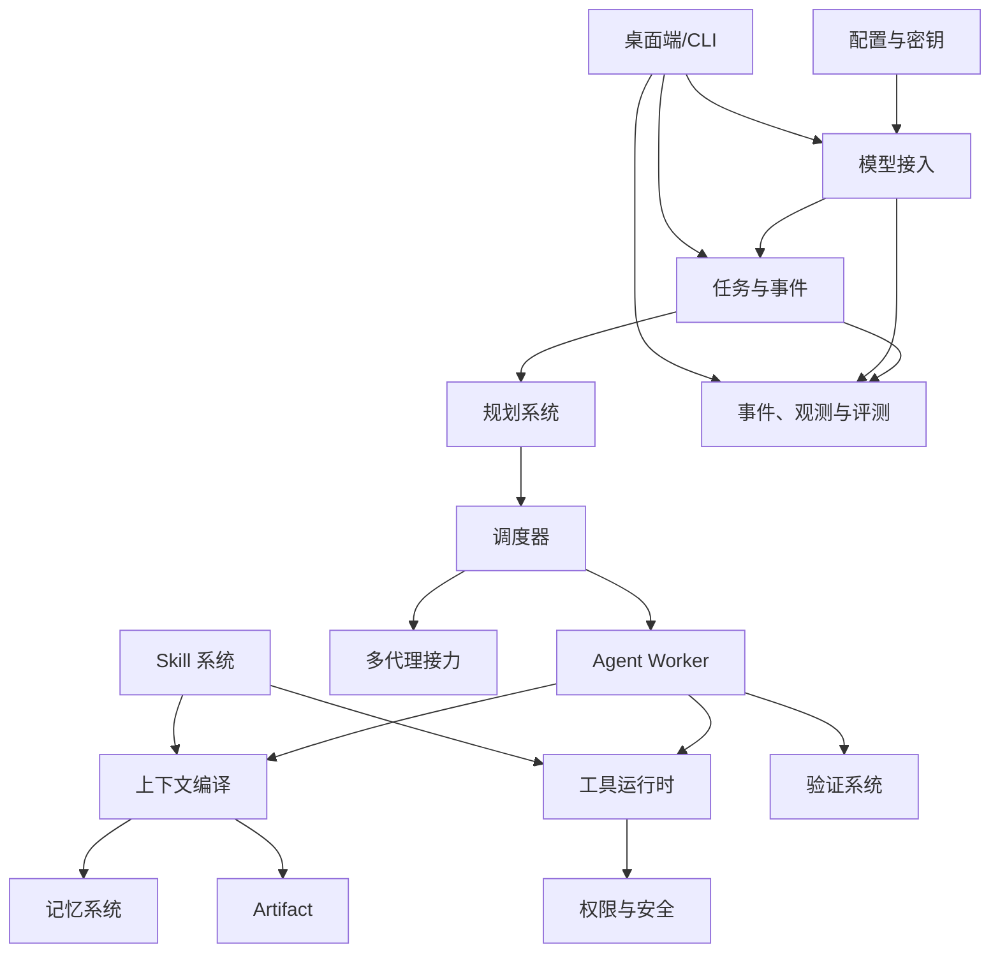

# SimplenessAgent 核心模块与功能规格

## 1. 文档说明

本文将总体架构拆成可独立开发、测试和验收的模块。每个模块都说明开发目的、职责边界、主要功能、依赖、失败处理和 MVP 验收条件。

模块之间只通过明确接口、事件和持久化对象协作，禁止直接读取其他模块的内部状态。

## 2. 模块依赖总览

## 3. Workspace 模块

### 开发目的

建立用户授权的工作边界，为文件、命令、索引、记忆和权限提供统一作用域。

### 核心功能

- 创建、打开、关闭和归档 Workspace。
- 保存规范化根路径、显示名称和稳定 ID。
- 检测 Git 仓库、主要语言、构建工具和常用测试入口。
- 记录允许访问的附加目录。
- 生成项目概览和目录摘要。
- 监听关键文件变更，标记索引需要更新。
- 保存 Workspace 级模型、权限、Skill 和上下文策略。

### 输入与输出

- 输入：用户选择路径、附加路径、权限策略。
- 输出：`WorkspaceProfile`、环境探测 Artifact、索引任务。

### 失败处理

- 路径不存在、权限不足、符号链接越界时拒绝创建。
- 工作区临时不可用时保留配置但禁止执行写工具。
- Git 状态探测失败不阻塞非 Git 工作区。

### MVP 验收

- 可以安全打开包含中文和空格的 Windows 路径。
- 所有文件工具都不能越过授权根目录。
- 可以识别项目是否为 Git 仓库并输出干净/脏状态。

## 4. 配置、密钥与运行环境模块

### 开发目的

统一管理全局、Workspace 和 Task 级配置，并保证敏感信息不会写入普通配置、日志或模型上下文。

### 核心功能

- 分层配置：默认值、全局、Workspace、Task Override。
- Schema 校验、版本和迁移。
- API Key 写入操作系统凭据存储。
- 环境变量白名单和脱敏展示。
- 导入、导出非敏感配置。
- 启动诊断：数据目录、数据库、WebView、Runtime、磁盘空间。

### MVP 验收

- 配置升级可自动迁移。
- API Key 不出现在 SQLite 明文字段、日志和诊断包。
- 无效配置在启动阶段给出具体字段错误。

## 5. Model Provider 模块

### 开发目的

让 Agent Core 使用统一模型接口，并将本地模型、远程 API、协议差异和运行参数隔离在边界内。

### 核心功能

- Provider 注册与版本管理。
- `Chat`、`ChatStream`、`CountTokens`、`HealthCheck`、`ProbeCapabilities`。
- 独立的 `Embed` 和 `Rerank` 接口。
- OpenAI-compatible 请求与响应适配。
- 流式事件、Tool Call、Reasoning、Usage、Finish Reason 标准化。
- 超时、取消、有限重试和错误分类。
- 原始请求/响应脱敏后保存为可选调试 Artifact。

### 关键对象

- `ProviderDefinition`：协议实现。
- `Deployment`：具体端点和连接配置。
- `ModelProfile`：角色参数和限制。
- `CapabilitySnapshot`：实际探测能力。
- `DeploymentFingerprint`：评测复现信息。

### 失败处理

- 网络失败、限流、上下文溢出、内容过滤、协议错误分别编码。
- 评测模式禁止自动切换 Deployment。
- 普通模式只有用户显式启用备用路由才可故障转移。

### MVP 验收

- 同一 Task 可在本地 OpenAI-compatible 端点和远程 API 间切换。
- Tool Call、工具结果回传和流式文本得到统一对象。
- 调用可以被取消，超时不会遗留无主请求状态。

## 6. Model Manager 模块

### 开发目的

为普通用户提供本地模型的一键发现、下载、启动和诊断能力。

### 核心功能

- 硬件探测：系统、架构、CPU 指令、内存、GPU、显存和驱动摘要。
- Runtime Manifest：不同平台的 llama.cpp 等运行包。
- Model Manifest：模型、量化、大小、校验和、最低建议硬件。
- 模型下载、暂停、断点续传、校验、导入、删除。
- 启动参数生成、端口分配、PID 和日志管理。
- 就绪探测、健康检查、重启和优雅终止。
- 用户已有 vLLM/SGLang/Ollama/LM Studio 端点发现。

### 失败处理

- 磁盘不足时在下载前阻止。
- 校验失败的文件进入隔离区，不可加载。
- Runtime 启动失败返回具体日志 Artifact。
- 不支持的硬件提供 API 模式或较小模型建议，不强行启动。

### MVP 验收

- 可以托管一个本地 llama.cpp Server 并注册为 Deployment。
- 程序重启后不会重复启动同一端口的僵尸服务。
- 模型文件具备完整性校验和删除确认。

## 7. Session 与消息模块

### 开发目的

提供用户交互记录和流式展示，同时保持与 Task 执行状态解耦。

### 核心功能

- 创建、重命名、搜索、归档 Session。
- 消息流式增量写入。
- 消息关联 Task、Step、Tool Call 和 Artifact。
- 协议原子性修复：Tool Call 与 Tool Result 配对。
- UI 消息和模型消息分离，避免界面占位内容进入模型上下文。
- 长会话显示压缩边界和 Checkpoint。

### MVP 验收

- Session 消息删除不破坏 Task 状态和 Artifact。
- 应用崩溃后可恢复到最后已提交消息。
- 不产生孤立 Tool Result 导致模型 API 请求无效。

## 8. Task 与 Event Store 模块

### 开发目的

成为系统事实来源，承载任务状态、运行记录和崩溃恢复。

### 核心功能

- TaskSpec 创建、版本和状态机。
- Run、Step、Attempt 生命周期。
- 追加式 Event Log。
- 事务性物化状态更新。
- Checkpoint 生成、加载和兼容性检查。
- Task 取消、暂停、恢复、重试和派生新任务。
- Event Replay 重建状态。

### 关键规则

- 每次状态迁移必须有事件。
- Tool 执行意图必须先于副作用持久化。
- 事件带 `event_version`，旧版本可迁移。
- UI 只能发命令，不能直接改数据库状态。

### MVP 验收

- 在任意合法状态强制关闭程序后可以恢复。
- Event Replay 得到与物化表一致的 Task 状态。
- 非法状态迁移被拒绝并留下审计日志。

## 9. Planning 模块

### 开发目的

把复杂任务从自由推理转化为可执行、可验证、可重规划的结构化步骤。

### 核心功能

- Task 复杂度判断和最小计划模板。
- 只读 Reconnaissance。
- Planner Prompt 与结构化 Plan 输出。
- Plan Schema 校验和一次格式修复。
- DAG 合法性、依赖、预算、权限和输出契约校验。
- Plan Version 与变更原因。
- 局部重规划和下游影响分析。
- 用户计划审核和编辑。

### 失败处理

- 计划无法解析时不进入执行。
- 缺失关键决策时进入 `WAITING_USER`。
- 超过最大步骤数时要求 Planner 合并或分阶段。
- 达到重规划上限后进入 `FAILED` 或 `WAITING_USER`。

### MVP 验收

- 能生成并校验无环 DAG。
- 每个 Step 都具有输入、输出、工具和验收条件。
- 重规划不会重置已经验证完成的步骤。

## 10. Scheduler 模块

### 开发目的

以确定性方式推进计划、控制并发和预算，不依赖模型自行管理长任务。

### 核心功能

- 计算 Ready Set。
- 根据依赖、风险、资源和本地模型吞吐选择 Step。
- 串行和有限并行执行。
- 全局和 Step 级超时、Token、尝试次数、成本预算。
- 暂停、取消和恢复。
- 公平调度多个 Task。
- 处理 Worker、Tool、Verifier 返回的标准结果。

### 调度规则

- 共享本地单模型时默认并发较低。
- 写同一文件或使用同一终端的 Step 不并发。
- 风险审批步骤阻塞自身及依赖链，不阻塞无关只读步骤。
- 并发由程序决定，不要求模型一次生成多个工具调用。

### MVP 验收

- Ready Set 计算正确。
- 取消 Task 能传播到模型请求和工具子进程。
- 预算耗尽后不会继续启动新 Step。

## 11. Agent Worker 模块

### 开发目的

将模型调用限制在单目标、有限工具和有限上下文内，形成可控 ReAct 执行循环。

### 核心功能

- 根据 Role 和 Step 创建 Worker。
- 构建固定系统合同和动态 Context Package。
- 原生 Tool Calling 优先，受控 JSON 备用协议。
- 单轮一个 Tool Call 的小模型友好模式。
- 最大迭代、空响应、重复动作和卡死检测。
- 接收运行中用户补充信息。
- 输出标准 `AgentReport`。

### 停止条件

- 验收条件已满足。
- Worker 明确需要用户输入。
- 工具或模型出现不可恢复错误。
- 达到迭代或 Token 预算。
- 调度器取消。

### MVP 验收

- 无效 Tool Call 只产生错误结果，不直接执行。
- 连续重复同一动作会被检测并停止。
- Worker 不能直接访问未授权工具。

## 12. Context Compiler 模块

### 开发目的

在有限 Token 预算内，为当前角色和步骤生成最小充分、来源清晰的上下文。

### 核心功能

- 模型特定 Token 计数或保守估算。
- 固定合同、Task、Plan、最近消息、记忆、Skill、Artifact 的分区预算。
- 当前 Step 查询分解。
- 关键词、向量、关系和时间检索。
- 去重、融合、Rerank 和裁剪。
- Tool Schema 和 Skill 渐进式加载。
- 上下文预览和来源解释。
- 超限时先压缩 Tool/Artifact，再压缩历史。

### MVP 验收

- 上下文不超过 Deployment 安全预算。
- Tool Call/Result 不被裁剪成非法半对。
- 用户可以查看某条记忆为何被注入。

## 13. Memory 模块

### 开发目的

保存跨会话、跨任务仍有价值的事实、决策、偏好、经验和任务进度，同时避免错误记忆污染。

### 核心功能

- Working、Episodic、Semantic、User、Procedural 五类记忆。
- 从事件和 Artifact 提取候选记忆。
- Schema、来源、置信度、作用域、时效校验。
- 去重、冲突、替代、归档、压制和删除。
- FTS5 与向量混合检索。
- 手工创建、固定、修改和忘记。
- 记忆健康审计和重建索引。

### MVP 验收

- 每条自动记忆都可以追溯到 Event 或 Artifact。
- 被压制或过期的记忆不会自动注入。
- 冲突信息不会被静默覆盖。

## 14. Artifact 模块

### 开发目的

承载超出模型上下文的大型产物，为任务、记忆、验证和接力提供稳定引用。

### 核心功能

- 内容寻址或稳定 ID。
- 原子写入、大小、MIME、哈希和来源元数据。
- 文本片段读取和行范围读取。
- Tool Result 自动外置。
- Artifact 与 Task、Step、Memory、Report 的多对多关联。
- 保留、归档、清理和导出策略。

### MVP 验收

- 大型工具输出不会直接进入完整上下文。
- Artifact 校验失败时不可作为验证证据。
- 删除 Task 前能够预览受影响的共享 Artifact。

## 15. Tool Runtime 模块

### 开发目的

把模型意图安全地转化为确定性系统动作。

### 首批工具

- `list_files`
- `read_file`
- `search_text`
- `read_artifact`
- `write_file`
- `apply_patch`
- `execute_command`
- `start_command`
- `collect_output`
- `interrupt_command`
- `git_status`
- `git_diff`
- `ask_user`
- `load_skill`

### 核心功能

- Tool Registry 和版本。
- 输入输出 JSON Schema。
- 参数验证和规范化。
- 风险与权限判定。
- Write-ahead、幂等键、超时、取消和有限重试。
- 标准 ToolResult 与 Artifact 外置。
- MCP Tool 发现、缓存、白名单和调用。

### MVP 验收

- 所有工具有契约测试。
- 写工具不能越过 Workspace。
- 崩溃恢复不会重复同一副作用。
- 输出达到限制时保留首尾、摘要和完整 Artifact 引用。

## 16. Skill 模块

### 开发目的

将高质量流程、约束、模板和脚本沉淀为可复用程序记忆，减少模型临时推理负担。

### 核心功能

- Skill 包导入、创建、编辑、禁用、锁定、导出。
- `SKILL.md` 与 `skill.yaml` 解析。
- 名称、描述、触发条件、输入输出、工具白名单和版本。
- Skill 索引注入和按需加载。
- 附件、模板、脚本和示例按需读取。
- Skill 静态检查、测试用例和兼容性声明。

### MVP 验收

- 未选中的 Skill 正文不会进入上下文。
- Skill 不能获得声明之外的工具。
- 锁定 Skill 不能被 Agent 自动修改。

## 17. Verification 模块

### 开发目的

阻止模型仅凭主观声明完成任务，将结果与用户验收标准绑定。

### 验证优先级

1. Schema 和静态规则。
2. 文件、哈希、Diff 和路径断言。
3. 命令退出码、单测、构建、Lint。
4. 结构化数据比较。
5. 只读 Verifier Agent。
6. 用户人工验收。

### 核心功能

- VerificationSpec 注册。
- 每个 Step 的验证执行。
- Evidence 收集和可信度。
- 失败分类：实现错误、环境错误、计划假设错误、不可验证。
- 决定完成、重试、重规划或等待用户。

### MVP 验收

- 无 Evidence 的 Step 不能自动完成。
- 测试失败会关联日志 Artifact。
- Verifier 不获得写工具。

## 18. Multi-Agent Relay 模块

### 开发目的

通过上下文隔离、有限并行和结构化接力延长任务跨度，而不是增加无约束讨论。

### 核心功能

- Agent Instance 生命周期。
- Role、目标、工具、上下文和预算隔离。
- 单层子 Agent。
- AgentReport、HandoffEnvelope 和 Artifact 交付。
- 心跳、取消、超时和僵尸回收。
- 父任务对结果进行验证后再合并。

### MVP 验收

- 子 Agent 不读取未分配的主会话内容。
- 子 Agent 退出后结果仍可从持久化 Report 读取。
- 父任务取消会传播到所有活动子 Agent。

## 19. Policy、Approval 与 Sandbox 模块

### 开发目的

建立独立于 Prompt 的安全控制面。

### 核心功能

- Capability-based 权限。
- 只读、写入、危险、外部副作用风险等级。
- 路径、命令、环境变量、网络和 MCP 策略。
- 一次、会话、Workspace 和永久审批范围。
- 审批票据绑定工具参数哈希，防止批准后换参。
- Sandbox Backend 能力矩阵和 fail-closed。
- Secret Redaction 和审计日志。

### MVP 验收

- 模型把删除命令标成只读仍会被策略识别。
- 审批只对展示过的参数生效。
- Sandbox 不可用时给出明确提示，不自动无限制执行。

## 20. Observability 与 Evaluation 模块

### 开发目的

让开发者和用户理解模型、计划、工具、上下文和恢复链路，并持续量化改进效果。

### 核心功能

- Task/Run/Step Trace。
- 模型首 Token、总耗时、Token、成本和错误。
- Tool 延迟、退出码、重试和输出大小。
- Context 分区、检索来源和压缩次数。
- Event Timeline 和 Replay。
- Golden Task Suite。
- Deployment A/B 对比。
- 回归阈值和报告导出。

### MVP 验收

- 任一失败 Task 可以定位到具体 Step、Attempt、模型调用或 Tool Call。
- 同一 Case 可选择不同 Deployment 重跑。
- 报告包含 Deployment Fingerprint。

## 21. Desktop UI 与 CLI 模块

### 开发目的

将复杂运行状态转化为普通用户可以理解和控制的产品体验。

### 核心功能

- 首次启动和模型向导。
- Workspace、Session、Task 管理。
- 计划审核、步骤状态、时间线和 Artifact。
- 权限审批、用户问题和任务干预。
- 上下文、记忆和能力探测预览。
- 设置、诊断、模型下载和日志导出。
- CLI 与桌面端功能对齐。

### MVP 验收

- UI 关闭不导致后台 Task 状态丢失。
- 用户在三次点击内可以看到任务为何等待或失败。
- 所有危险操作显示目标、原因和影响范围。

## 22. Packaging、Update 与 Migration 模块

### 开发目的

把开发项目转化为可安装、可升级、可诊断的软件。

### 核心功能

- Windows 安装包、卸载和快捷方式。
- WebView2 检测或固定运行时策略。
- 程序、Runtime 和模型分离发布。
- 数据库迁移和备份。
- 自动更新、签名、校验和回滚。
- 诊断包导出。
- 离线 Runtime/模型导入。

### MVP 验收

- 在干净 Windows 环境安装后可以打开并完成首次向导。
- 升级不会丢失 Task、Memory、Skill 和配置。
- 卸载时明确询问是否保留用户数据和模型。

