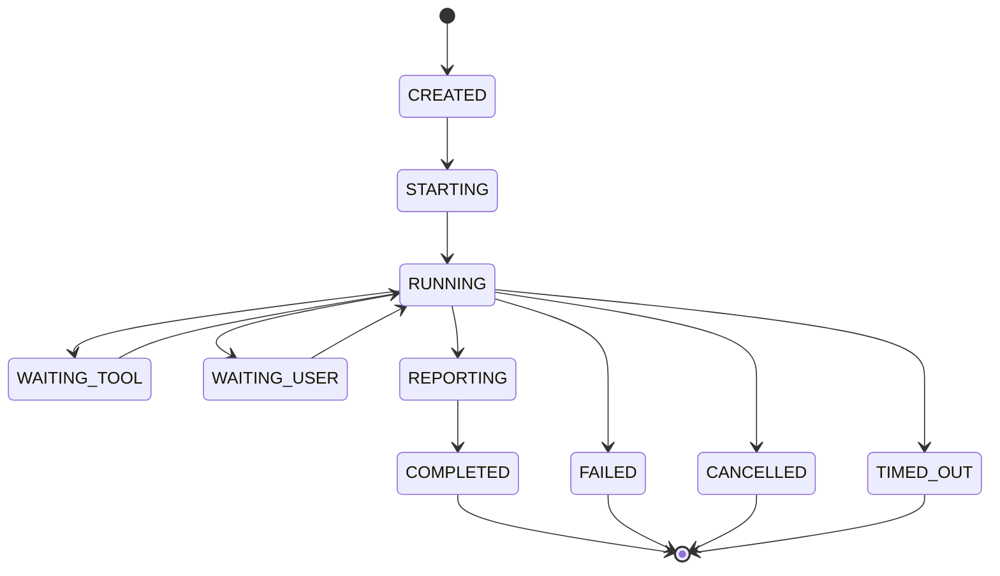

# SimplenessAgent 多代理与任务接力系统

## 1. 设计目的

多 Agent 的目的不是模拟组织结构或增加讨论热闹度，而是解决以下问题：

- 一个上下文无法长期承载全部任务细节。
- 多个独立步骤可以并行完成。
- 不同任务需要不同 Skill、工具和知识范围。
- Worker 接近上下文或迭代上限时，需要由新 Worker 继续。
- 主 Agent 不应直接携带所有子任务的原始过程。

## 2. 不解决的问题

- 不通过增加 Agent 数量弥补模糊目标。
- 不让 Agent 自由建立无限层级组织。
- 不使用无主持人群聊决定真实任务状态。
- 不把同一个任务简单复制给多个 Agent 后投票当作默认策略。
- 不允许多个 Agent 无协调地修改共享资源。

## 3. 角色定义

### Coordinator

由 Go 调度器实现，负责：

- Plan 和 Ready Set。
- Agent 创建和资源分配。
- 并发、预算、取消和超时。
- 报告持久化。
- 结果验证和状态迁移。

Coordinator 不是模型角色。

### Planner Agent

- 只读。
- 接收 TaskSpec、ReconReport 和相关约束。
- 输出 Plan Draft。
- 不能执行计划。

### Executor Agent

- 只处理一个 Step。
- 获得工具白名单和有限 Workspace Scope。
- 输出 AgentReport 和 Artifact。

### Verifier Agent

- 只读。
- 获得验收标准和 Evidence。
- 输出验证结论和缺口。
- 不能修改结果以让验证通过。

### Specialist Agent

由 Skill 定义能力边界，例如代码审查、数据库分析或文档整理。它仍然遵守统一 Worker、Tool、Report 和权限协议。

### Memory Curator

异步提炼候选记忆，不参与 Task 状态推进。

## 4. 多 Agent 触发条件

只有满足以下至少一项才考虑创建子 Agent：

- Plan 中存在两个以上无依赖、无资源冲突的 Ready Steps。
- 当前 Step 的知识领域需要专用 Skill。
- 主 Worker 上下文接近安全预算。
- 子任务输出可以形成独立 Artifact 和验收标准。
- 任务明确要求多个独立分析视角。

以下情况不创建：

- 单个简单工具动作。
- 多个步骤会写同一文件。
- 子任务无法定义独立完成条件。
- 本地模型运行时不支持有效并发。
- 多 Agent 开销超过剩余预算。

## 5. 生命周期



所有 Agent Instance 和状态迁移持久化。进程重启后，运行中实例不会直接假定仍在运行，而是进入恢复审计。

## 6. 第一阶段限制

- 最大深度：1。
- 默认并发：2。
- 单 Task 最大活动子 Agent：4。
- 子 Agent 最大迭代：由 StepBudget 限制。
- 子 Agent 不能创建新的子 Agent。
- 子 Agent 不继承父 Agent 的全部工具和权限。
- 子 Agent 不能直接改变 Plan。
- 子 Agent 不直接写主会话消息，只发布事件和 Report。

具体数值作为可配置安全上限，但默认值必须保守。

## 7. 上下文隔离

子 Agent 只获得：

- Task 目标摘要。
- 当前 StepSpec。
- 必要的全局约束。
- 指定 Artifact。
- 按 Step 检索的记忆与项目知识。
- 选中的 Skill。
- 工具白名单和权限 Scope。
- 预算和停止条件。

默认不获得：

- 父 Session 完整历史。
- 无关 Step 的详细执行过程。
- 未分配 Workspace 路径。
- 父 Agent 的隐藏推理。
- 其他子 Agent 的实时对话。

## 8. AgentReport

子 Agent 的最终输出必须符合结构：

```json
{
  "version": 1,
  "agent_id": "agent_xxx",
  "step_id": "step_xxx",
  "status": "SUCCEEDED",
  "summary": "完成了指定模块分析",
  "claims": [
    {
      "text": "模块存在未处理的取消路径",
      "evidence_ids": ["evd_xxx"]
    }
  ],
  "artifact_ids": ["art_xxx"],
  "changes": [],
  "open_questions": [],
  "risks": [],
  "recommended_next_actions": [],
  "metrics": {
    "iterations": 4,
    "input_tokens": 12000,
    "output_tokens": 1800
  }
}
```

`status=SUCCEEDED` 不等于 Step 完成，仍需 Verification。

## 9. HandoffEnvelope

用于 Worker 接力或跨进程恢复：

- Handoff ID 和版本。
- Task/Run/Plan Version。
- 原始目标和非目标。
- 不可违反约束。
- 当前 Step 和完成条件。
- 已完成、失败、阻塞步骤摘要。
- 关键决策及来源。
- Artifact 和 Evidence 引用。
- 已尝试方法和失败原因。
- 当前预算消耗和剩余预算。
- Ready Steps。
- 未决审批和用户问题。
- 创建原因：上下文压力、超时、手工交接、进程恢复。

Handoff 生成后运行 Schema 和引用完整性校验。

## 10. 并行执行

### 10.1 资源冲突检查

Scheduler 在并行前检查：

- 写文件集合是否重叠。
- 是否使用同一终端 Session。
- 是否修改同一 Git 工作区。
- 是否共享非并发安全工具。
- 本地模型 Deployment 是否有足够并发容量。

### 10.2 合并策略

- 只读报告可以直接并列进入验证。
- 不同文件修改在验证后统一检查 Diff 和测试。
- 可能冲突的修改使用独立工作目录或 Git Worktree；首期可选择禁止并行写。
- 合并由确定性逻辑或明确的 Integration Step 完成。

## 11. 接力触发

- Context 使用超过阈值。
- Worker 达到最大迭代但任务仍可继续。
- 角色需要从 Executor 切换为 Specialist。
- 用户要求暂停后由新 Deployment 继续。
- 应用重启后恢复。

接力前先生成结构化 Checkpoint 和 Handoff，不把完整聊天直接复制给新 Worker。

## 12. 通信方式

第一阶段采用持久化消息和事件，不实现自由 Agent Chat：

- Coordinator 向 Agent 发送 Assignment。
- Agent 发布 Progress Event。
- Agent 请求 Tool/Approval/User Input。
- Agent 完成后提交 AgentReport。
- Agent 之间通过 Artifact 和 Handoff 间接通信。

后续如增加 Agent Message，也必须有消息类型、目标、大小限制和持久化，不能成为另一条无约束聊天链。

## 13. 失败与恢复

### 子 Agent 失败

Scheduler 根据错误类型：

- 同一 Agent 重试。
- 使用新 Agent 和 Handoff 重试。
- 切换 Deployment，普通模式需符合路由策略。
- 请求重新规划。
- 等待用户。

### 僵尸回收

- Agent 有租约和心跳时间。
- 超时后取消模型和工具。
- 本地进程状态经过审计。
- 未完成 Tool Call 由幂等模块判断是否可以安全重试。

### 父任务取消

取消按树传播：

- 停止启动新 Agent。
- 取消活动模型请求。
- 取消或终止工具子进程。
- 保存最终 Checkpoint。

## 14. UI 表现

用户看到的是计划中的负责人和状态，而不是多个聊天窗口：

- Step 标记执行角色和 Agent ID。
- 子 Agent 运行时显示目标、预算和最近事件。
- AgentReport 作为可展开产物。
- 并行步骤使用泳道或分组时间线。
- 接力显示“由 Agent A 交接给 Agent B”及原因。

## 15. 评测指标

- 多 Agent 相比串行的完成率变化。
- 总耗时和总 Token 变化。
- Handoff 后完成率。
- Artifact/Evidence 丢失率。
- 冲突修改次数。
- 取消传播耗时。
- 僵尸 Agent 数量，目标为零。
- 不必要创建子 Agent 的比例。

## 16. 开发顺序

1. Agent Instance 和 Assignment 数据结构。
2. 单子 Agent、同步等待和 AgentReport。
3. 持久化异步运行、状态和取消。
4. Handoff 和接力。
5. 两个只读 Step 并行。
6. 资源冲突检查。
7. UI 和评测。
8. 核心稳定后再讨论远程 Agent 或多层结构。

## 17. 验收场景

- 两个只读分析 Step 并行，结果与串行相同。
- 主程序关闭后，AgentReport 和状态不丢失。
- Worker 达到上下文阈值后通过 Handoff 继续。
- 子 Agent 尝试调用未授权工具时被拒绝。
- 父 Task 取消后所有子 Agent 和命令停止。
- 两个写同一文件的 Step 不会被并行调度。

